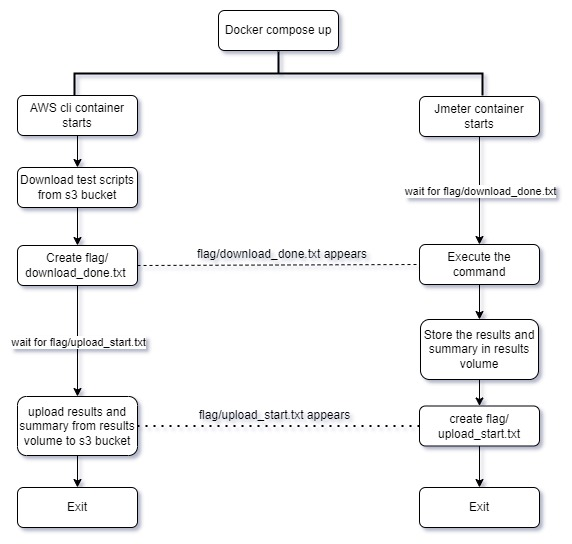

# JmeterPerformanceAutomation
- This is the Jmeter performance automation project. The project is deployed in the kubernetes using docker-desktop daemon and k8sdeployment.yaml file is written.  
- Please make sure the docker desktop daemon is running and is configure/enable to handle the kubernetes clusters.  
- The database holds the location data of gujarat state and the latest and official mssql image is used for the database.  
- justb4/jmeter is the unofficial image used to test the API. this is the image which contains .sh file by the help of that file we can run the command.  
- amazon/aws-cli image is used to download the test scripts files(.jmx files) and upload results and summary in the s3 bucket.  

### kubectl apply command:
`kubectl apply -f k8sdeployment.yaml`  
This should be the command to run the create the kubernetes pods, services, PVCs and jmeter and awscli jobs. There will be the credentials needed to the mssql pod as database password, as well as aws cli pod as the access key and secret key.  
Database password is also needed to the api pod to connect to the database.  
There will be some changes with the connection string in appsetting.json file that is currently commented with appropriate message. The changes are with the port and the service name to connect to mssql database.  
That changes should be done and after that `docker build -t jmeterclidemo . ` is to be run in the directory exactly where docker file is currently present when you clone this project. 

### The command for creating database and seeding data into it.
`dotnet ef database update --connection "Server=localhost,<port>;Initial Catalog=<databasename>;User ID=<username>;Password=<Password>;TrustServerCertificate=true"`  
- when the command is run, the migration files are already there in the migration folder, so it will apply those pending migration. So it will create the database and table.  
- Also it will seed the data of gujarat state's district data containing 232 rows.  
- To connect to the database from local machine in order to apply migrations you have to run the following command:  
`kubectl prot-forward service/<mssql-service-name> <free-local-port>:<service-port>`.  
- replace the mssql-service-name with the service name and free-local-port represents the local machine prot and service-port represents to the cluster port to which the mssql-service (external service) is listening to.  
* port: this is the local machine port which is binded to the mssql service.  

### Options to configure the Jmeter command for test:
* Jusers : Represents the number of users/threads.
* Jrampup : Represents the rampup time.
* Jendpoint : Represents the endpoint of request.
* Jhttpmethod : Represents the http method.
* Jtokenendpoint: Represents the endpoint to hit to generate the token(By post request) for the jmx file.
* Jresponsetime : Represents the expected response time. It is the duration time for the duration assertion. If command takes more than the given Jresponsetime the assertion will fail and it will give error as 500 and response message as Time Limit Exceed. For all the below commands, default response time for duration assertion is 10 milliseconds. 
* Jloop : Represents the loop count for the testing plan to execute.
* Jstartupdelay : Represents the startup delay.
* Jduration : Represents the duration for the thread execution.
* Jinputfile : Define the path of the input data csv file(used in the POST endpoint to define the payload data).  
For more information visit: https://www.toolsqa.com/jmeter/thread-group-in-jmeter-test-plan

### commandscript.sh file:
- This is the file containing all the commands to run when the jmeter container will start. As it is the shell script, it can containes multiple commands with different endpoints and different test file for each command(.jmx file).  
- You can append any command to this file to test any endpoint.  
### Imp. Note: In any script(.sh file), keep the line ending as LF, otherwise it will give errors when you run it in docker. You can set line ending by VSCode or Notepad++.

### Result and summary:
- The result(.jtl file) and summary(.txt text file) for the perticular command execution is stored in the result folder.
- Result file contains the information about each iteration of the command execution.
- Summary file contains the summary of the whole execution command, like average, min, max elapsedtime of all iteration and the error rate.
- Result folder is mounted with the results volume.  

### AWS cli:
- The official image of aws cli i.e. amazon/aws-cli is used.
- It will download the jmeter test-scripts(.jmx file) from the aws s3 bucket.
- The results will also be uploaded in the aws s3 bucket.  

### Pub-sub approach:
- The flag volume is used for this approach and it is mounted to flag folder of awscli and jmeter container.
- As both the container starts, Jmeter will wait for the download_done.txt file to be created in the flag folder which is mounted to the flag volume.
- The awscli container will download the test-scripts(.jmx file) from the aws s3 bucket and stored in the test-scripts folder which is mounted to the test-scripts volume. And then it will make download_done.txt in flag folder which is mounted to the flag volume.
- Then Awscli container will wait for the upload_start.txt file to be created in the flag folder.
- As download_done appears to the jmeter container it will delete this file and start command executions and the jmx file it requires are present(downlaoded by awscli) in the test-scripts folder which is mounted to the test-scripts volume.
- The results are stored in the results folder which is mounted to the results volume. After storing result and summary files in the results folder the jmeter container will create the upload_start.txt in the flag folder and then it will exit.
- As uplaod_start.txt file appears to the awscli container, it will delete this file and upload the jmeter results and summary files (from results volume mounted to the results folder of awscli container) to the aws s3 bucket.  

  

### About JWT bearer:
- The code for Jwt token generation is there with the /GetToken endpoint in demo api.
- When we request to this endpoint it will return us the token with all the configuration and the token expiry date is 1 hour. which is set in the code.  
- All the test files(.jmx files) have one setup thread group which runs only once per jmx file. It will request to the /GetToken endpoint and get the token. Then it will extract and store the token value to the props.
- The main testing thread group will get this token value from the props and pass it in the header manager with authorization header attribute.
- Note: The authorization attribute value must be like Bearer <token-value>. i.e. Bearer<space><token-value>. If it is not, then it can not parse the bearer token value and will give error as unauthorized.  

## Tested command for examples
### Get By ID command:
`jmeter -n -t /jmeter/test-scripts/TestFileGet.jmx -l /jmeter/results/TestFileGetByID-detail.jtl -f -Jusers=100 -Jrampup=1 -Jendpoint=https://jmeterclidemo:443/Get/13F3423E-F36B-1410-80A5-00EF02B43D90 -Jhttpmethod=GET -Jtokenendpoint=https://jmeterclidemo:443/GetToken -Jresponsetime=4500 > /jmeter/results/TestFileGetByID-summary.txt -Dfile.encoding=UTF-8`  
Here in above command if we don't pass the method then it will take GET as default method. Results are stored in the TestFileGetByID-detail.jtl file and summary is store in the TestFileGetByID-summary.txt file with UTF-8 file encoding.  
***

### Get All data command:
`jmeter -n -t /jmeter/test-scripts/TestFileGet.jmx -l /jmeter/results/TestFileGet-detail.jtl -f -Jusers=100 -Jrampup=1 -Jendpoint=https://jmeterclidemo:443/Get -Jhttpmethod=GET -Jtokenendpoint=https://jmeterclidemo:443/GetToken  -Jresponsetime=800 > /jmeter/results/TestFileGet-summary.txt -Dfile.encoding=UTF-8`  
Here in above command if we don't pass the method then it will take GET as default method. and response time is 800 milliseconds for each thread(request). Results are stored in the TestFileGet-detail.jtl file and summary is store in the TestFileGet-summary.txt file.  
***

### Post Request:
`jmeter -n -t /jmeter/test-scripts/TestFilePOST.jmx -l /jmeter/results/TestFilePOST-detail.jtl -f -Jusers=100 -Jrampup=1 -Jendpoint=https://jmeterclidemo:443/Post -Jhttpmethod=POST -Jtokenendpoint=https://jmeterclidemo:443/GetToken  -Jinputfile=/jmeter/test-scripts/data.csv -Jresponsetime=700 > /jmeter/results/TestFilePOST-summary.txt -Dfile.encoding=UTF-8`  
Here in above command if we don't pass the method then it will take POST as default method. And response time is 6 milliseconds for each thread. Results are stored in the TestFilePOST-detail.jtl file and summary is store in the TestFilePOST-summary.txt file.  
***

### Put Request:
`jmeter -n -t /jmeter/test-scripts/TestFilePut.jmx -l /jmeter/results/TestFilePut-detail.jtl -f -Jusers=1 -Jrampup=1 -Jendpoint=https://jmeterclidemo:443/UpdateByTownCode/823942 -Jhttpmethod=PUT -Jtokenendpoint=https://jmeterclidemo:443/GetToken  -Jresponsetime=6 -Jloop=100 > /jmeter/results/TestFilePut-summary.txt -Dfile.encoding=UTF-8`  
Here in above command if we don't pass the method then it will take PUT as default method. And response time is 6 milliseconds for each thread. Results are stored in the TestFilePut-detail.jtl file and summary is store in the TestFilePut-summary.txt file.  
***
